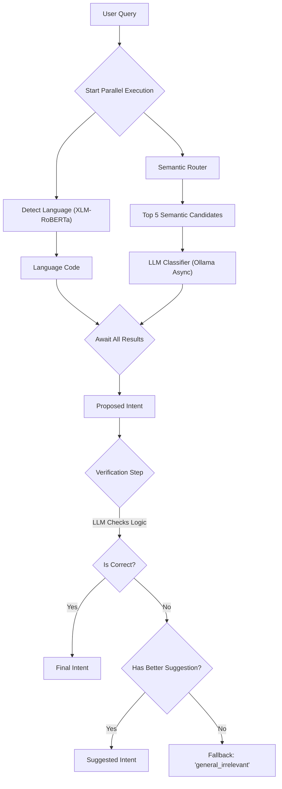

# Intent Classification Flow

```mermaid
graph TD
    A["User Query"] --> PARALLEL_START{Start Parallel Execution}
    
    %% Path 1: Language Detection (Independent)
    PARALLEL_START --> B["Detect Language (XLM-RoBERTa)"]
    B --> C["Language Code"]
    
    %% Path 2: Classification Chain
    PARALLEL_START --> D["Semantic Router"]
    D --> E["Top 5 Semantic Candidates"]
    E --> F["LLM Classifier (Ollama Async)"]
    
    %% Synchronization Point
    C --> JOIN{Await All Results}
    F --> JOIN
    
    JOIN --> G["Proposed Intent"]
    G --> H{"Verification Step"}
    H -->|"LLM Checks Logic"| I{"Is Correct?"}
    I -- Yes --> J["Final Intent"]
    I -- No --> K{"Has Better Suggestion?"}
    K -- Yes --> L["Suggested Intent"]
    K -- No --> M["Fallback: 'general_irrelevant'"]
```
